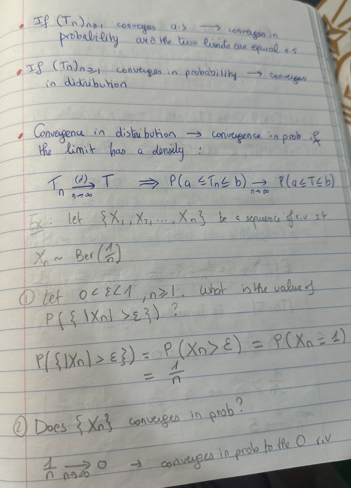
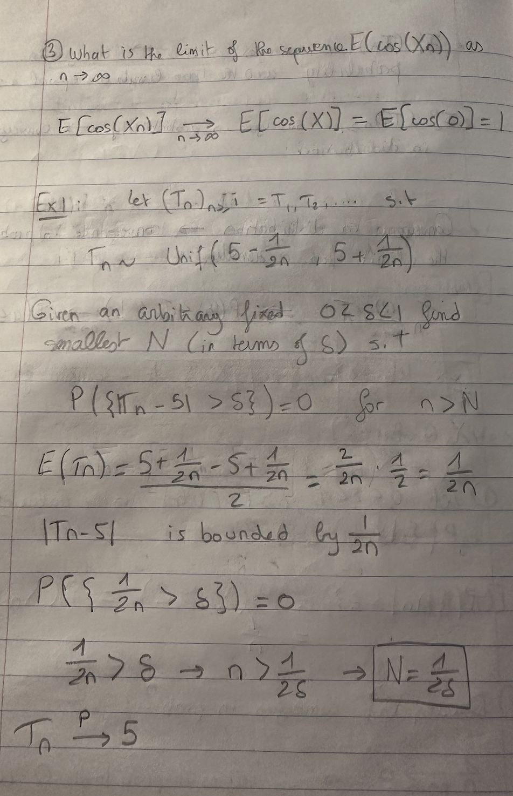
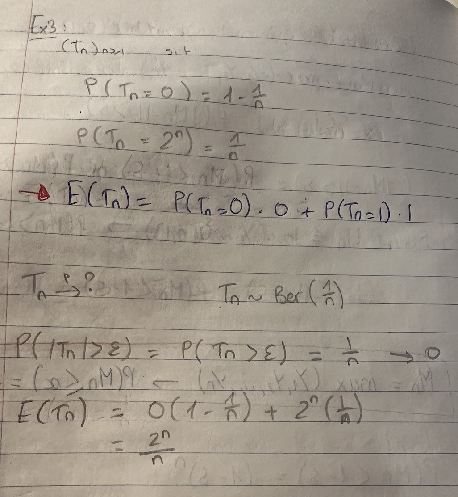

# Modes of Convergence 

There are 3 types of convergence : convergence almost surely (a.s, strongest), convergence in probability (P) and convergence in distribution (d, weakest).

Let $(T_n)_{n \geq 1}$ be a sequence of random variables ($T_i$ is a random variable).

## Almost Surely (a.s) convergence

$T_n$ and T live in the same space. 

$T_n \xrightarrow{\text{a.s.}} T \iff \mathbb{P}({w : T_n(w) \xrightarrow{\text{ₙ→∞}} T(w)}) = 1$

## Convergence in Probability (P)

$T_n$ and T live in the same space. 

$T_n \xrightarrow{\text{P}} T \iff \mathbb{P}(|T_n - T| \geq \epsilon) \xrightarrow{\text{ₙ→∞}} 0)$

## Convergence in Distribution (d)

$T_n$ and T do not live in the same space. 

$T_n \xrightarrow{\text{d}} T \iff \mathbb{E}(f(T_n)) \xrightarrow{\text{ₙ→∞}} E(f(T)) $

for all continuous bounded functions f.

## Addition, Multiplication, Division 

Can only be used for a.s and P convergences.

Assume $T_n \xrightarrow{\text{a.s,P}} T$ and $U_n \xrightarrow{\text{a.s,P}} U$

1) $T_n + U_n \xrightarrow{a.s} T + U$
2) $T_n * U_n \xrightarrow{a.s} TU$
3) If $U ≠ 0$ a.s then $\frac{T_n}{U_n} \xrightarrow{a.s} \frac{T}{U}$

## Slutsky's Theorem 

This is used for convergence in distribution. Let $T_n \xrightarrow{\text{d}} T$ and $U_n \xrightarrow{\text{d}} u$.
Here u is a single real number, P(U=u) = 1.

1) $T_n + U_n \xrightarrow{d} T + u$
2) $T_n * U_n \xrightarrow{d} Tu$
3) If $u ≠ 0$ a.s then $\frac{T_n}{U_n} \xrightarrow{d} \frac{T}{u}$

## Continuous Mapping Theorem

For **continuous** functions, and all 3 types of convergence, we have :
$T_n \xrightarrow{c} T  \iff f(T_n)\xrightarrow{c} f(T)$

### Notes on Poisson Distribution

$Poiss(\lambda) = \frac{c*\lambda^k}{k!}$

$P(X=k) = \frac{\lambda^{k} * e^{-\lambda}}{k!}$

$X~Poiss(\lambda) : E(X) = Var(X) = \lambda$

**NOTE :** 
1) $n^{th}$ moment of a random variable X is given by $E[X^n]$
2) Given n i.i.d realizations ($X_1, ..., X_n)$ ~ Ber(p), we get $\sum{X_i}$ ~ Binomial(n,p)
3) $E[X^2] = Var[X] + (E[X])^2$

