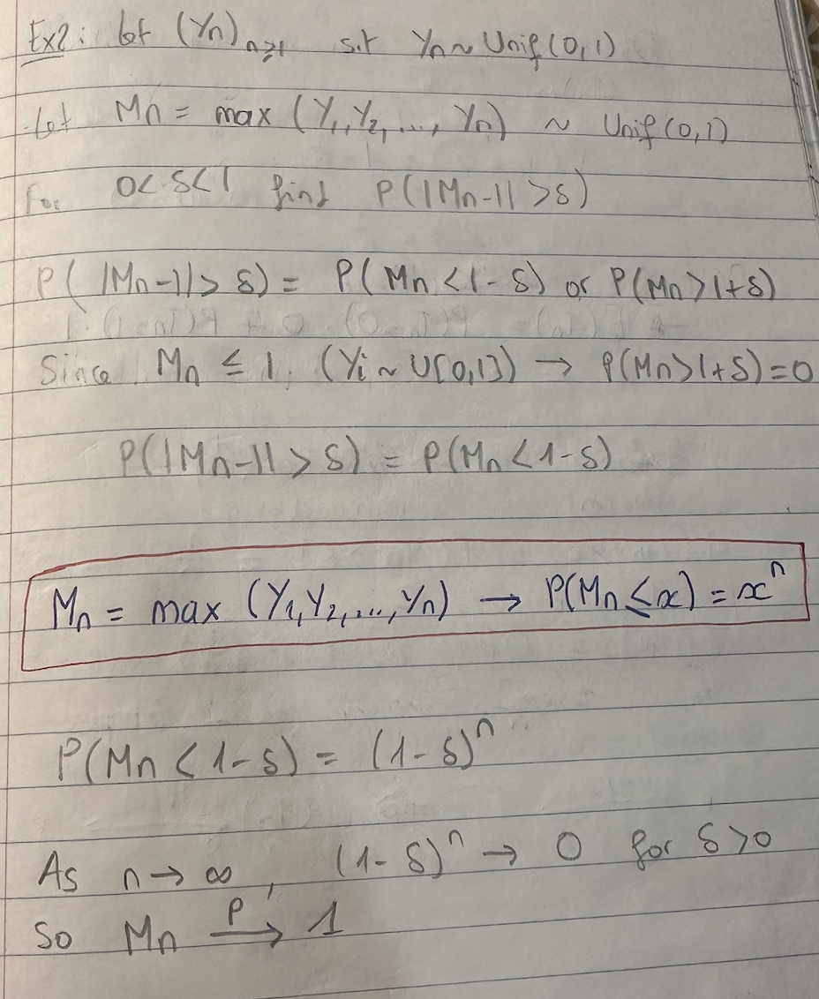

# Modes of Convergence 

There are 3 types of convergence : convergence almost surely (a.s, strongest), convergence in probability (P) and convergence in distribution (d, weakest).

Let $(T_n)_{n \geq 1}$ be a sequence of random variables ($T_i$ is a random variable).

## Almost Surely (a.s) convergence

$T_n$ and T live in the same space. 

$T_n \xrightarrow{\text{a.s.}} T \iff \mathbb{P}({w : T_n(w) \xrightarrow{\text{ₙ→∞}} T(w)}) = 1$

## Convergence in Probability (P)

$T_n$ and T live in the same space. 

$T_n \xrightarrow{\text{P}} T \iff \mathbb{P}(|T_n - T| \geq \epsilon) \xrightarrow{\text{ₙ→∞}} 0)$

## Convergence in Distribution (d)

$T_n$ and T do not live in the same space. 

$T_n \xrightarrow{\text{d}} T \iff \mathbb{E}(f(T_n)) \xrightarrow{\text{ₙ→∞}} E(f(T)) $

for all continuous bounded functions f.

## Addition, Multiplication, Division :

Can only be used for a.s and P convergences.

Assume $T_n \xrightarrow{\text{a.s,P}} T$ and $U_n \xrightarrow{\text{a.s,P}} U$

1) $T_n + U_n \xrightarrow{a.s} T + U$
2) $T_n * U_n \xrightarrow{a.s} TU$
3) If $U ≠ 0$ a.s then $\frac{T_n}{U_n} \xrightarrow{a.s} \frac{T}{U}$
