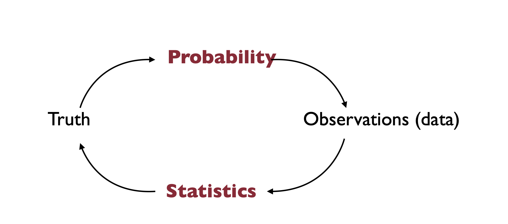
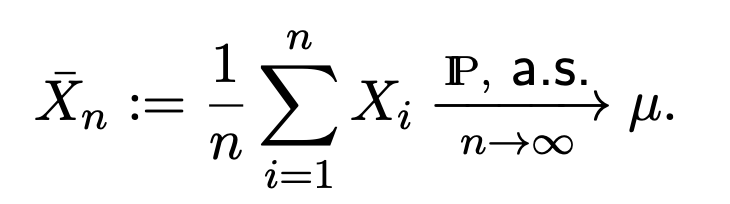
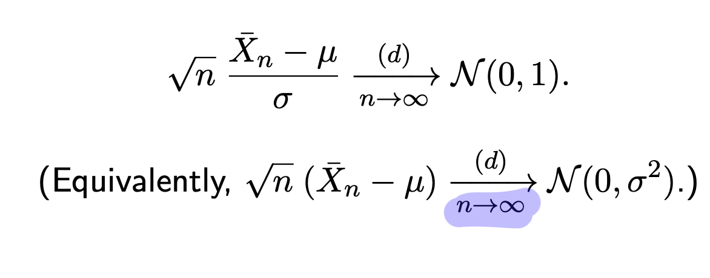
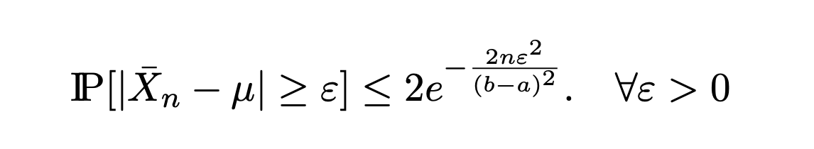
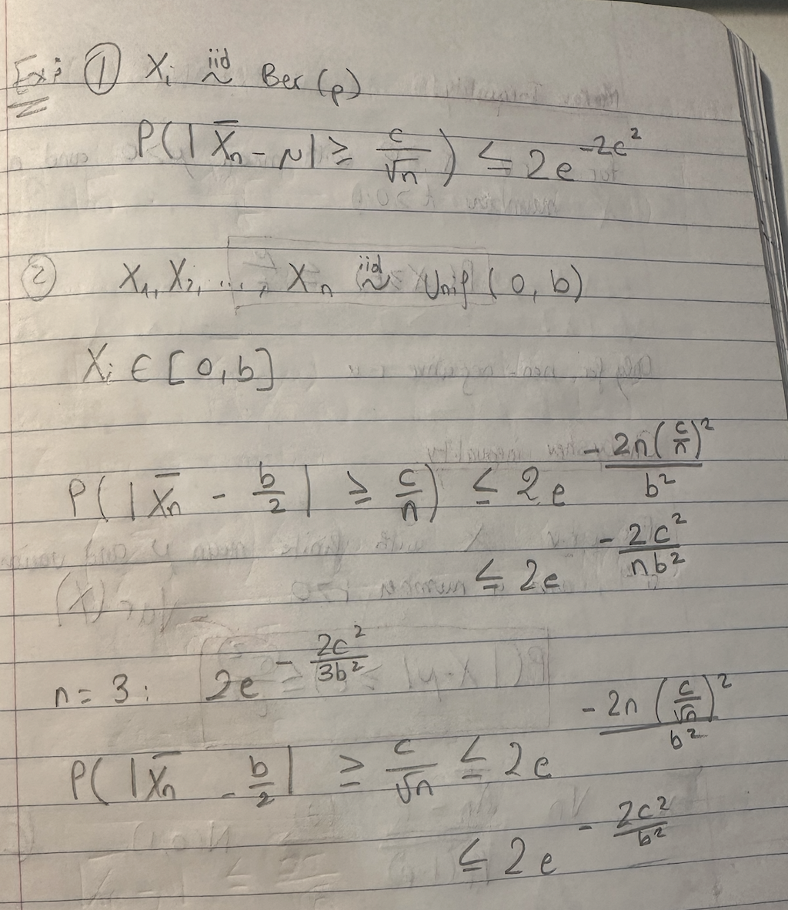

# Introduction and Probability 

Statistics, Data science, ML, AI, ... , What is the difference ? 

All are **data driven** fields : gather data to get innsight and ultimately make decisions.

**Statistics** is at the core of the *data processing* part. **Computational** aspects play an important role as data becomes larger.

Computational View : data is a (large) sequence of numbers that needs to be processed by a relatively fast algorithm : approximate nearest neighbors, low dimensional embeddings, spectral methods, ....

Statistical View : data comes from a **random process** and the goal is to learn how this process works in order to make predictrions or understand what plays a role in it.

## Probability

Probability studies randomness.

Sometimes the process is completely known : 
Example 1 : Rollinng 1 die :
- Alice gets 1$ if #dots $\leq 3$
- Bob gets 2$ if #dots $\leq 2$
  
Who do you want to be Alice or Bob ?

E(A) = $\frac{3}{6} * 1$ = 0.5$

E(B) = $\frac{2}{6} * 2$ = 0.66$

So you want to be Bob.

Example 2 : Rolling 2 dice :
Alice and Bob play a game where 2 fair 6-sided dice are rolled.
- Alice gets 1$ if the sum of the numbers of the 2 dice is a prime number
- Bob gets 3$ if the numbers on the two dice are the same

Who makes more money on average ?

Sum of dice : 2,3,...,12
Total number of outcomes = 36
Prime numbers are : {2,3,5,7,11}

E(A) = $\frac{15}{36} * 1$ = 0.4167$

E(B) = $\frac{6}{36} * 3$ = 0.5$

So Bob makes more money.

## Statistics 

Need to estimate parameters from data.
- Sometimes we have **real randomness**
- Sometimes deterministic but too complex phenomenon --> **Statistical Modeling**
      Complicated process "=" Simple process + random noise where random noise is the model assumptions.

  Good modeling consists in choosing (plausible) simple process **AND** noise distribution.

Usually random noise will average out if we have infinite amount of data. So we want our data to give us insight and not model the noise. So we want as much information as possible in the "simple process" and as little as possible in the "random noise".

Statistics helps us assess how accurate we are in understanding the truth based on data. The more targeted our question about the data is, the more precise our answer will be.

### Example of a Statistical Experiment

People observed that there is a "neonatal right-sided preference to kissing that makes a surprising romantic reappearance later in life". Here we mean that people observed that couples prefere to lean to the right when they kiss.
To see if this is true, statisticians conducted and experiment.

Let p denote the proportion of couples that turn their head to the right when kissing.

Let us design a statistical experiment and analyze the outcome.

Observe n kissing couples and collect the value of each outcome : 1 : Right, 0 : Left. Here we have n = 124. We want to **Estimate p with the proportion $\hat{p}$ of right**.

Study : "Human behavior : Adult persistence of head-turning asymmetry" (Nature,2003) : n=124 and 80 to the right so :
        $\hat{p} = \frac{80}{124} = 64.5%$

Now, the intuition is that 64.5% > 50% so there seems to be a preference for turning right --> Is is **Statistically significant?** 
If we only have 3 observations as right,right,left, we would get 66.7% to the right but is this representative of the true distribution ?

We need a **large enough sample size n** to make good conclusions !!! How large ?? --> **Mathematical Modeling**

### First Estimator 

For i = 1,...,n, define $R_i = 1$ if the $i^{th}$ couple turns to teh right and $R_i = 0$ otherwise.

The estimator of p is the **sample average** :

 $\hat{p} = \bar{R_n} = \frac{1}{n} * \sum_{i=1}^n R_i$
where $\hat{p}$ and $R_i$ are random variables.

We need to make some **Modelling Assumptions** here : 
- Each $R_i$ is a random variable(r.v).
- Each of the r.v is **Bernoulli** with parameter p
- $R_1, ..., R_n$ are mutually independent.

**BERNOULLI RANDOM VARIABLES**

$R_i$ ~ Ber(p) : 
- $R_i \in {0,1}$
- P($R_i=1$) = p
- P($R_i=0$) = 1-p
- P($R_i = a$) = $\binom{n}{k} * p^a * (1-p)^{n-a}$
- P($R_i \leq a$) = 1 - P($R_i = a$)
- E($R_i$) = p
- Var($R_i$) = p(1-p)

## Probability Redux 

### Average of R.V : LLN & CLT :

Let $X_1, ..., X_n$ be i.i.d r.v, $\mu = E[X]$ and $\sigma^2$ = Var[X]

**1) Laws (weak and strong) of Large Numbers (LLN) :**

 

Where weak LLN is when the convergence is in probability P, and strong LLN is when the convergence is almost surely (a.s) as n -> infinity. This only works for **large enough n** !!!!!

**2) Central Limit Theorem (CLT)**

(d) means converges in distribution.

 

This works if $n \geq 30$

**$\bar{X_n}$ ~ N($\mu$, $\frac{\sigma^2}{n}$)**

*What if n is not large enough to apply CLT?*

**Hoeffding's Inequality**

Let n be a positive integer and $X, X_1, ..., X_n$ be i.i.d r.v such that  $\mu = E[X]$ and $X \in [a,b]$ almost surely (a < b given numbers)
Then : 

This holds even for small sample sizes mn

